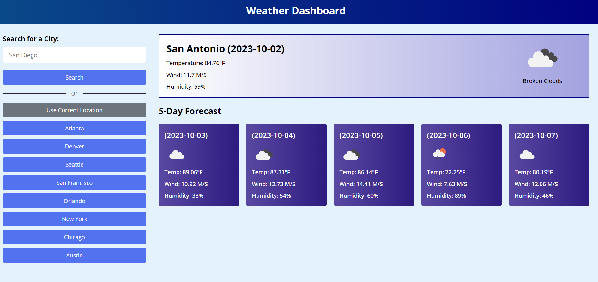

# Weather Dashboard

Weather Dashboard is designed to search for a specific city and return weather data from a 3rd party API.  In this case openweatherMap API.  

## Visuals

()

## YouTube Tutorials and References
```
https://www.youtube.com/watch?v=SeXg3AX82ig&t=212s

https://www.youtube.com/watch?v=w0VEOghdMpQ&t=1425s

https://www.youtube.com/watch?v=MIYQR-Ybrn4&t=911s
```

## Links
```
Live URL:  https://8bitginger.github.io/WeatherDashboard
Repo URL: https://github.com/8BitGinger/WeatherDashboard
Student Portfolio URL: https://github.com/8BitGinger/studentPortfolio
```

## Roadmap
Will need to get the date to show in a more traditional format.  

## Support
reach out to ryan.fann@gmail.com for questions or support issues


## Contributions
Weather API:
```
https://openweathermap.org/api
```
## License

[MIT](https://choosealicense.com/licenses/mit/)